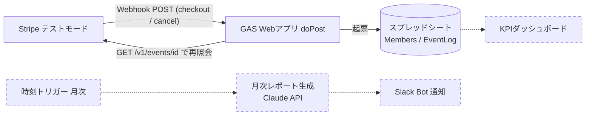

# gas-membership-kit

会員制コミュニティの運用を Google Apps Script だけで自動化する個人プロジェクト。Stripe の入退会を Webhook で受けてスプレッドシートの会員DBに起票し、月次レポート生成（Claude API）と Slack 通知、KPI集計まで持っていく。サーバは立てない。ランニングコストは Claude API の従量課金のみ。

すべて Stripe **テストモード**で動かす前提で、実カード・実課金は一切使わない。

<!-- TODO: デモGIF（Payment Linkでテスト決済 → Membersシートに行が増える様子） -->

## 構成



点線は未実装（ロードマップ参照）。シーケンスの詳細は [docs/architecture.md](docs/architecture.md)。

## 設計判断: なぜ署名検証ではなく「再照会検証」なのか

Stripe Webhook の標準的な受け方は `Stripe-Signature` ヘッダーの HMAC 検証だが、**GAS の `doPost` は HTTP ヘッダーを受け取れない**。これは Google が公式に「サポートしない」と明言している仕様で（[Apps Script コミュニティでの公式回答](https://groups.google.com/g/google-apps-script-community/c/bgnzoAUV_No)）、回避策はない。つまり GAS 単体では署名検証は不可能。

プロキシサーバを挟めば署名検証できるが、それをやると「GASだけで完結・サーバ不要」という構成の利点が消える。そこでこのプロジェクトは二段の代替検証にした。

1. **URLトークン**: Webhook URL に `?token=<ランダム32hex>` を付けて登録し、`doPost` で照合する。不一致なら本文をパースすらしない
2. **再照会検証**: 受信ペイロードから `event.id` だけを取り出し、`GET /v1/events/{id}` を Stripe に叩き直す。**Stripe から返ってきたイベントオブジェクトだけを正として処理し、受信ペイロードは信用しない**。偽造リクエストは実在しないイベントIDしか持てないので、ここで落ちる

副作用がひとつあって、Stripe ダッシュボードの「テストイベントを送信」は ID が実在しない合成イベントなので、この方式では**設計どおり拒否される**。正常系のテストには Stripe CLI の `stripe trigger` か、Payment Link での実テスト決済を使う（[docs/setup-stripe.md](docs/setup-stripe.md)）。

シートへ書き込む自由入力文字列（会員の name / email、ログの summary 等）は、先頭が `=` `+` `-` `@` の場合にアポストロフィを付けてテキスト扱いを強制している。スプレッドシートをそのまま管理画面として使う構成では、Checkout で顧客が入力した請求先名などを経由した数式インジェクション（CWE-1236）が実害になるため。

もうひとつの制約として、GAS の Web アプリは HTTP ステータスコードを制御できず、拒否時も 200 相当が返る。Stripe 側からは常に成功に見えるため、受信結果は良否問わずすべて EventLog シートに記録し、そこを唯一の観測手段にしている。取りこぼしはダッシュボードの再送ボタンで手動リカバリする運用。

## 機能とロードマップ

| # | 機能 | 状態 |
|---|------|------|
| 1 | Stripe Webhook → 会員DB起票（入会/退会） | 実装済み |
| 2 | 月次バッチ → Claude API で会員ごとのレポート文生成 | 予定（report.js） |
| 3 | Slack Bot 通知（チャンネル投稿 + DM） | 予定（slack.js） |
| 4 | KPIダッシュボード（会員数・継続率の自動集計） | 予定（kpi.js） |

この4つで完成。機能追加はしない。

## Webhook の処理フロー（機能1）

```
doPost
 ├─ 1. URLトークン照合 ──────── 不一致: token_ng でログして終了
 ├─ 2. JSONパース ───────────── 失敗: parse_error
 ├─ 3. スクリプトロック取得 ──── 失敗: error（同時リトライの二重起票防止）
 ├─ 4. 冪等性チェック ────────── 処理済み event_id: duplicate
 ├─ 5. Stripeへ再照会 ────────── 実在しない: not_found_on_stripe
 └─ 6. 起票
      ├─ checkout.session.completed (mode=subscription のみ) → 入会 upsert
      └─ customer.subscription.deleted → status=canceled に更新
```

購読イベントはこの2つだけに絞った。`customer.created` は入会確定前にも飛び、`invoice.paid` は毎月飛んでログのノイズになる。`customer.subscription.updated` を足すと到着順序（Stripe は順序を保証しない）の考慮が要るので、状態遷移を単純に保つためにあえて入れていない。

## シートスキーマ

**Members**（主キー = stripe_customer_id。物理削除はしない。履歴が消えると継続率が計算できなくなる）

| カラム | 用途 |
|---|---|
| stripe_customer_id | 主キー。upsert の照合キー |
| stripe_subscription_id | 退会イベントとの突合 |
| email / name | 会員特定・レポート宛名 |
| plan | Stripe price ID |
| status | active / canceled |
| joined_at / canceled_at | 入退会日時。継続率KPIの元データ |
| last_event_at | 最終更新イベント時刻 |
| slack_user_id | 機能3のDM用（当面手入力） |

**EventLog**（追記オンリー。冪等性キー = event_id）

| カラム | 用途 |
|---|---|
| received_at / event_id / event_type / livemode | 受信イベントの同定 |
| verification | verified / token_ng / not_found_on_stripe / parse_error |
| processing | processed / duplicate / type_ignored / error |
| customer_id / summary / error_message | 調査用 |

## セットアップ

1. [docs/setup-gas.md](docs/setup-gas.md) — スプレッドシート、clasp、Script Properties、Webアプリのデプロイ
2. [docs/setup-stripe.md](docs/setup-stripe.md) — Stripe テスト環境、Webhook エンドポイント登録、Stripe CLI でのテスト

シークレット（`sk_test_...` / Webhook トークン / スプレッドシートID）はすべて GAS の Script Properties に置く。リポジトリには含まれない。`.clasp.json` も scriptId を含むため gitignore 済みで、雛形は `.clasp.json.example`。

## 既知の制約

- HTTP ステータスを返せないため、Stripe の自動リトライを自分側の障害時に誘発できない。EventLog を見て手動再送する
- 冪等性チェックは EventLog シートの全走査（TextFinder）。個人コミュニティの件数なら十分だが、大量イベントには向かない
- テストモード専用として設計している。本番転用するなら少なくとも署名検証（プロキシ経由）と livemode チェックの厳格化が必要

## ライセンス

MIT
