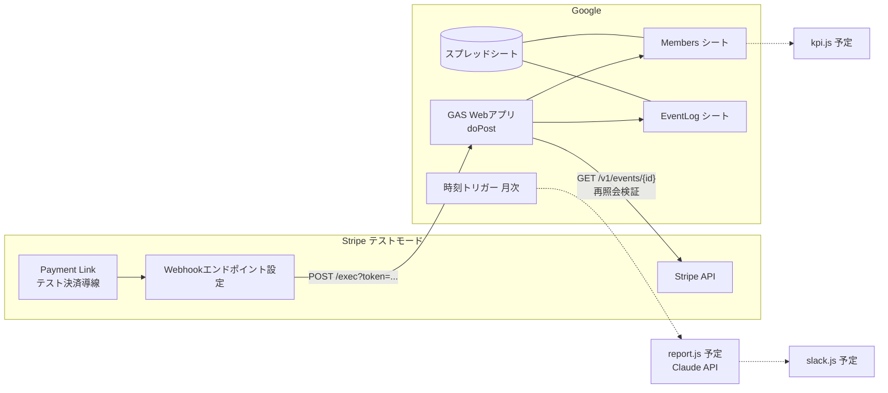
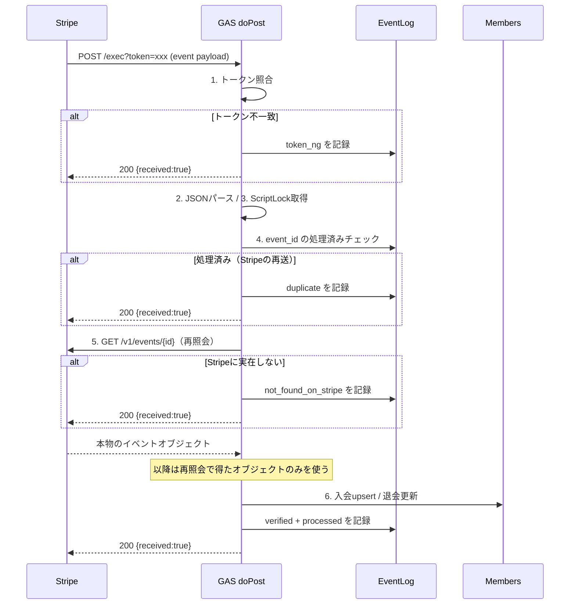

# アーキテクチャ

## 全体図

点線は未実装（機能2〜4）。

## 機能1: Webhook受信のシーケンス

## 設計上の割り切り

- **GASはHTTPステータスを制御できない** ため、どの結果でも 200 相当を返す。障害検知とリカバリは EventLog シート + Stripe ダッシュボードの再送機能に寄せる
- **ロック → 冪等性チェック → 再照会 → 起票** の順序は固定。ロックより先に冪等性を見ると同時リトライで二重起票する
- 会員行は物理削除しない。`status` の更新のみ。継続率KPI（機能4）が joined_at / canceled_at の履歴に依存するため
